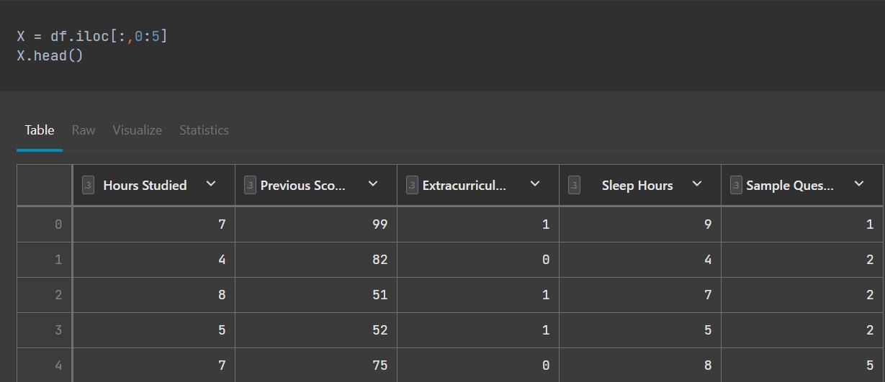
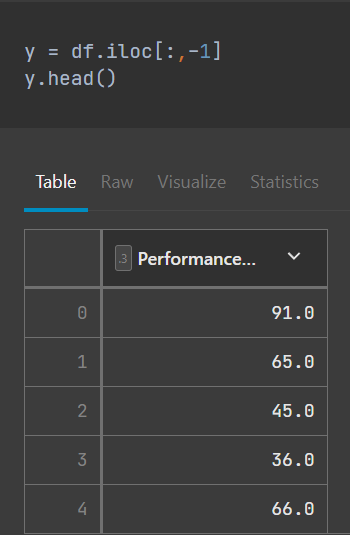
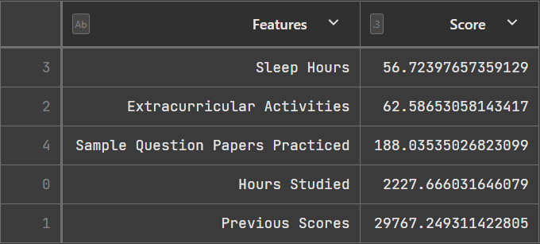
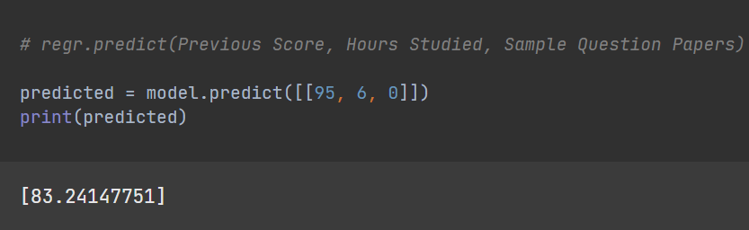
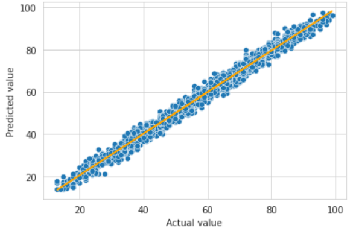
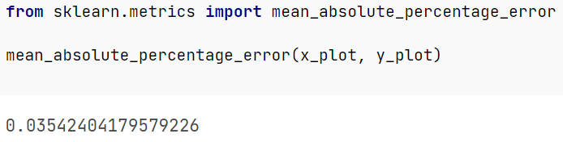

# Students' Performance Project
## Introduction
The objective of this project is to practice using Python and its libraries in order to analyze a dataset. In particular, the questions I want to answer from this dataset on students' performance index were:
- Is there a correlation between the performance of a student and their previous test scores?
- What are the three top factors in a student's academic performance?
- How does sleep affect a student's performance?

After answering those, the next step would be to use a regression model to predict a student's performance based on the top factors. To assist me, I referenced [this article](https://365datascience.com/tutorials/python-tutorials/predictive-model-python/) [2] to determine the top factors that affect a student's performance, and a guide on [multiple regression](https://www.w3schools.com/python/python_ml_multiple_regression.asp) [3] for my predictive model.

The data was split 80/20 for training and testing, and was done with the help of [this article](https://medium.com/machine-learning-with-python/multiple-linear-regression-implementation-in-python-2de9b303fc0c) [4]

## Selection of Data
The model was created using Datalore, a python notebook, and the code can be found [here](codes/student_performance.ipynb)

The data has over 9000 samples with 6 features:
- Hours studied
- Previous scores
- Extracurricular activity (Yes or No)
- Hours of sleep
- How many sample questions were done
- Performance Index

This dataset can be found online at [Kaggle](https://www.kaggle.com/datasets/nikhil7280/student-performance-multiple-linear-regression) [1]

Data Preview: 
 

Note: In order to use the "Extracurricular Activities" column for feature selection, the "Yes" and "No" were changed to 1 and 0, respectively.

## Methods
Tools:
- NumPy, SciPy, Pandas, and Scikit-learn for data analysis and inference
- GitHub for version control
- Datalore for notebook editing

Inference methods used with Scikit:
- linear regression model
- feature selection

Linear regression is a simple data analysis technique that predicts a value of unknown given related and known data. It is modeled using a linear equation. Going more in depth, this project uses multiple regression, which is linear regression, but instead it predicts a value given more than one known value of data. This method of modeling is simple, but at the same time it will be less accurate if the values do not have a linear relationship with each other.

To determine the values to compare for the multiple regression model, the top three features are chosen to determine a value for the performance index.

To find the top three values, feature selection is used. SelectKBest was chosen to be used as the feature selection method, and it uses a variety of different statistical tests to rank the top features related to the output variable.

## Results

The top three features with the highest correlation to a student's performance index ranked by score: 

As for the question relating sleep with a student's performance, it had the lowest score out of all of the features. This meant that even if it did have a correlation, the other features would provide a more accurate prediction when creating a model. 

After building the model, it can be used to predict a student's performance based on the those top three factors. An example of predicting using the model can be shown here: 

To explore the accuracy of these predictions, I plotted a scatterplot of predicted values and actual values: 

In addition, the mean absolute percentage error was found using scikit-learn: 

## Discussion

Looking at the graph between the predicted and the actual values, there was a linear relationship  between those values, which meant that linear regression was the best method for this dataset. With the mean absolute percentage being as low as it was, this also meant that the top three features had a very strong relationship with a student's performance index. 

An idea for a future work for this project is to utilize this model in an app that asks for a student's information using those features and would return a prediction of the student's performance index. This app would be used only for the purposes of this project and not as a real scenario however, as this dataset is synthetic. In order to make this a more realistic analysis of actual students, a different dataset and possible different model would be needed.

## Summary

This project uses Datalore from JetBrains to build a predictive model using multiple linear regression in order to predict a student's performance index. Using the top three features that had the biggest correlation with a student's performance index, the model had a mean absolute percentage error of 0.035.

## References

[1] [Kaggle](https://www.kaggle.com/datasets/nikhil7280/student-performance-multiple-linear-regression)

[2] [Predictive model article](https://365datascience.com/tutorials/python-tutorials/predictive-model-python/)

[3] [Multiple regression article](https://www.w3schools.com/python/python_ml_multiple_regression.asp)

[4] [Multiple linear regression article with splitting data](https://medium.com/machine-learning-with-python/multiple-linear-regression-implementation-in-python-2de9b303fc0c)
